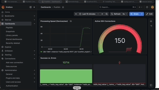

# 🚀 Pushkin Engine: High-Speed Network Automation

**Pushkin Engine** — это высокопроизводительный асинхронный фреймворк на Python для массовой конфигурации сетевого оборудования (Cisco, Juniper, Huawei, Eltex, Mikrotik и др.). 

Система спроектирована для работы в гипер-масштабируемых средах (до 1 000 000+ устройств). В отличие от классических решений (Netmiko, Ansible), Pushkin использует принцип **"Command Burst"** (залповая отправка) и **"Silence Timeout"** (таймаут тишины), что позволяет достигать теоретического предела скорости протокола SSH.



---

## 🛠 Технологический стек
*   **Engine:** Python 3.10+, AsyncSSH (Event-loop на базе `epoll`).
*   **API:** FastAPI (полностью асинхронный).
*   **Real-time:** Redis (Pub/Sub для стриминга + Storage для кэша логов).
*   **Front-end:** Xterm.js (эмуляция терминала в браузере через WebSockets).
*   **Monitoring:** Prometheus + Grafana (через `redis_exporter`).
*   **Security:** OAuth2 + JWT (Bearer Token).

---

## 📊 Производительность (Бенчмарки)

Благодаря неблокирующему вводу-выводу, время выполнения группы задач равно времени выполнения самого медленного устройства в пачке.


| Парк устройств | Кол-во потоков (`concurrent`) | Время выполнения | Скорость (устройств/сек) |
| :--- | :--- | :--- | :--- |
| **15 000** (Регион) | 500 | **~90 секунд** | ~166 dev/sec |
| **150 000** (Федерация) | 1500 | **~10-15 минут** | ~250 dev/sec |
| **ЭР-Телеком (Дом.ру)** | ~200k узлов | **~20 минут** | На 1 сервере (32 ядра) |
| **Ростелеком** | ~800k узлов | **~1.5 часа** | На кластере из 3 серверов |

---

## 📡 API Documentation

### 1. Авторизация (`POST /token`)
Получение временного JWT-токена для доступа к командам.
*   **Payload:** `username=admin&password=admin` (x-www-form-urlencoded).
*   **Response:** `{"access_token": "...", "token_type": "bearer"}`.

### 2. Запуск конфигурации (`POST /push`)
Отправка списка команд на группу устройств.
*   **Query Param:** `job_id` (optional) — ваш уникальный ID для отслеживания.
*   **Headers:** `Authorization: Bearer <token>`
*   **Body (JSON):**
```json
[
  {
    "ip": "mock_switch",
    "port": 22,
    "user": "admin",
    "pw": "admin",
    "cmds": ["conf t", "interface Gi0/1", "description PUSHKIN_TEST", "end"]
  }
]
```

### 3. Статус и Логи (`GET /status/{job_id}`)
Получение финального отчета о выполнении задачи.

### 4. Live Stream (`WS /ws/stream/{job_id}/{host}/{port}`)
WebSocket-канал для получения логов «буква в букву» в реальном времени. Используется встроенным UI (`index.html`).

---

## 🛡 Безопасность и "Предохранитель"
В движок встроен **Smart Safety Switch**. Он анализирует входящий поток данных в реальном времени:
1.  **Обнаружение:** При нахождении стоп-слов (`Invalid input`, `Error:`, `Syntax error`) отправка команд немедленно прерывается.
2.  **Rollback:** Система автоматически отправляет серию команд отката (`\x03`, `rollback`, `undo`) для возврата устройства в исходное состояние.
3.  **Reporting:** В ответе API указывается точная команда (`failed_on`), на которой возникла ошибка.

---

## 🏗 Enterprise Scaling (Тюнинг сервера)
Для обработки **150 000+ устройств** за 10-15 минут необходим сервер следующей конфигурации:
*   **CPU:** 32 Cores / 64 Threads (интенсивная криптография SSH).
*   **RAM:** 64 GB (буферизация логов).
*   **OS Limits:** 
    *   `ulimit -n 100000` (лимит файловых дескрипторов).
    *   `net.ipv4.ip_local_port_range = "1024 65535"` (диапазон исходящих портов).

---

## 👨‍💻 FAQ

**Сетевой инженер:** *"Как вы понимаете, что устройство закончило отвечать?"*
**Pushkin:** Мы используем алгоритм **Silence Timeout**. Если после отправки данных устройство молчит более 2 секунд (`quiet_period`), мы считаем вывод завершенным. Это избавляет от необходимости подстраиваться под разные prompt разных вендоров.

**CTO:** *"Насколько это безопасно для ядра сети?"*
**Pushkin:** Система использует изоляцию через семафоры (не перегружает сокеты устройств) и JWT-авторизацию. Вся история изменений хранится в Redis, что обеспечивает полный аудит действий администраторов.

---

## 🚀 Быстрый старт
```bash
# 1. Запуск всей инфраструктуры (API, Redis, Monitoring, 10 Mocks)
docker-compose up -d --build --scale mock_switch=10

# 2. Запуск бенчмарка на 15 000 устройств
python benchmark.py --total 15000 --concurrent 1000
```
*   Панель API: `http://localhost:8000`
*   Панель Grafana: `http://localhost:3000` (admin/admin)

---
*Pushkin Engine — конфигурация всей сети страны за время одного перерыва на кофе.* ☕️
