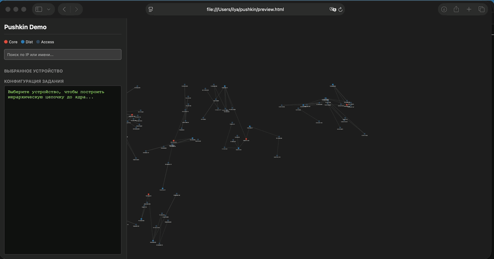

# 🚀 Pushkin Engine: High-Speed Network Automation

**Pushkin Engine** — это высокопроизводительный асинхронный фреймворк на Python для массовой конфигурации сетевого оборудования (Cisco, Juniper, Huawei, Eltex, Mikrotik и др.). 

Система спроектирована для работы в гипер-масштабируемых средах (до 1 000 000+ устройств). В отличие от классических решений (Netmiko, Ansible), Pushkin использует принцип **"Command Burst"** (залповая отправка) и **"Silence Timeout"** (таймаут тишины), что позволяет достигать теоретического предела скорости протокола SSH.



---

## 🚀 Быстрый старт
```bash
# 0. Скачать проект и установить зависимости
git clone https://github.com/iberestenko/pushkin

pip3 install asyncssh

# 1. Запуск всей инфраструктуры (API, Redis, Monitoring, 10 Mocks)
docker-compose up -d --build --scale mock_switch=10

# 2. Запуск бенчмарка на 15 000 устройств
python benchmark.py --total 15000 --concurrent 1000

# 3. Запуск шаблонов команд из текстового файла (см. ниже)
LOGNAME=admin python3 fire.py --dry-run jobs-cisco.txt cisco
```
*   Панель API: `http://localhost:8000`
*   Панель Grafana: `http://localhost:3000` (admin/admin)

---

## 🛠 Технологический стек
*   **Engine:** Python 3.10+, AsyncSSH (Event-loop на базе `epoll`).
*   **API:** FastAPI (полностью асинхронный).
*   **Real-time:** Redis (Pub/Sub для стриминга + Storage для кэша логов).
*   **Front-end:** Xterm.js (эмуляция терминала в браузере через WebSockets).
*   **Monitoring:** Prometheus + Grafana (через `redis_exporter`).
*   **Security:** OAuth2 + JWT (Bearer Token).

---

# Режимы работы асинхронного движка PushkinEngine

Движок поддерживает три архитектурных режима отправки конфигурации на сетевое оборудование. Выбор режима зависит от критичности вносимых изменений, требований к скорости и необходимости автоматического отката (Rollback).

## Сводная таблица режимов


| Режим | Название | Скорость (10+ уст.) | Логирование | Обработка ошибок и Откат (Rollback) | Основной кейс |
| :--- | :--- | :--- | :--- | :--- | :--- |
| `step` | Пошаговый (Netmiko-style) | До 1 секунды | Полное | **Да** (при первом стоп-слове) | Инвазивные и опасные настройки |
| `burst` | Пакетный (Fast Burst) | ~2-3 секунды | Полное | Нет (выполняет весь буфер) | Заливка больших готовых конфигов |
| `fast` | Экстремальный (Fire & Forget) | **~0.1 секунды** | Только отправка | Нет | Экстренные и массовые операции |

---

## Подробное описание и примеры конфигурации (`device_cfg`)

### 1. Режим `step` (Пошаговый контроль)
Движок отправляет команды строго по одной. Он дожидается ответа устройства (символа приглашения командной строки `>` или `#`) на каждый шаг, прежде чем отправить следующую строку. 
Если устройство возвращает ошибку (например, `invalid input`), выполнение прерывается и запускается процедура **Rollback**.

* **Плюс:** 100% контроль стабильности, ювелирная точность локализации сбоя.
* **Минус:** Самый медленный режим из-за постоянного ожидания Round Trip Time (RTT) сети на каждую строчку.

**Пример сценария (Изменение маршрутизации и VLAN):**
```json
{
    "ip": "10.0.0.11",
    "mode": "step",
    "cmds": [
        "vlan 120",
        "name BACKBONE_NEW",
        "exit",
        "interface GigabitEthernet0/1",
        "switchport trunk allowed vlan add 120"
    ]
}
```

---

### 2. Режим `burst` (Пакетная заливка с логами)
Движок отправляет весь список команд одной пачкой в сетевой сокет, выполняя один системный вызов `write()`. После этого он удерживает соединение открытым и собирает весь вывод устройства, пока оно не замолкнет на время, указанное в `quiet_period` (Таймаут тишины).

* **Плюс:** Накатка сотен строк конфигурации происходит в десятки раз быстрее, чем в режиме `step`.
* **Минус:** Ошибки в середине буфера не прерывают выполнение последующих команд. Откат не предусмотрен.

**Пример сценария (Заливка больших таблиц доступа ACL):**
```json
{
    "ip": "10.0.0.12",
    "mode": "burst",
    "quiet_period": 1.5,
    "cmds": [
        "ip access-list extended DMZ_IN",
        "permit tcp any host 10.1.1.5 eq 80",
        "permit tcp any host 10.1.1.6 eq 443",
        "deny ip any any"
    ]
}
```

---

### 3. Режим `fast` (Экстремальный выстрел)
Режим максимальной производительности по принципу «выстрелил и забыл» (Fire and Forget). Движок параллельно открывает сессии, выталкивает весь конфиг одной пачкой, принудительно вызывает `writer.drain()` для очистки буфера сетевой карты и **мгновенно закрывает сокет**, не тратя время на чтение ответов от оборудования.

* **Плюс:** Абсолютный рекорд скорости (доли секунды на сотни устройств параллельно).
* **Минус:** В результирующем логе будет пусто. Вы не узнаете, приняло ли устройство команды и были ли ошибки синтаксиса.

---

## 🛠️ Практические кейсы использования режима `fast`

Режим `fast` применяется для массовых, однотипных операций, результат которых безусловен и не влияет на дальнейший сценарий скрипта.

### Кейс А: Экстренное блокирование портов / Изоляция угрозы
При обнаружении вирусной активности или атаки ИБ-служба требует мгновенно изолировать сегмент сети или отключить скомпрометированный порт на сотнях коммутаторов доступа.
* **Скорость выполнения через `fast`:** менее **0.1 сек** на всю сеть.
* **Пример команд:**
  ```text
  interface GigabitEthernet0/24
  shutdown
  description ISOLATED_BY_SECURITY_TEAM
  ```
> 💡 **примечание:** В реальной сети порты подключения нарушителя на 1000 коммутаторах будут разными. Список команд `cmds` для каждого устройства должен формироваться внешней системой автоматизации (например, на основе CAM-таблиц из SIEM/NAC) **динамически до вызова движка**, обеспечивая точечное отключение целевого интерфейса на конкретном IP.


### Кейс Б: Массовый сбор бэкапов на внешний сервер (TFTP/SFTP)
Вместо выкачивания текста конфигурации в оперативную память скрипта, движок заставляет устройства самостоятельно отправить файлы на бэкап-сервер.
* **Почему именно `fast`:** Процесс передачи файла по сети выполняет сам роутер в фоне. Движку «Пушкин» незачем занимать память и ждать окончания загрузки — он бросает команду и мгновенно освобождает ресурсы.
* **Пример команд:**
  ```text
  copy running-config tftp://192.168.1.5/backup/router-conf.cfg
  ```

### Кейс В: Синхронизация системных параметров (NTP / DNS / Syslog)
Плановое или аварийное обновление адресов серверов инфраструктуры во всей корпоративной сети. Такие команды гарантированно применяются без ошибок, если шаблоны протестированы на симуляторе.
* **Пример команд:**
  ```text
  ntp server 172.16.100.50 prefer
  ip name-server 8.8.8.8
  logging host 172.16.100.60
  ```

### Кейс Г: Инвалидация кэшей и сброс таблиц маршрутизации (Clear-команды)
При изменении стыков с провайдерами или падении опорных каналов требуется мгновенно очистить таблицы динамической маршрутизации для ускорения сходимости сети.
* **Пример команд:**
  ```text
  clear ip arp
  clear ip bgp * soft
  clear mac address-table dynamic
  ```

### Кейс Д: Массовый запуск внутренних скриптов автоматизации (EEM)
Активация встроенных сценариев мониторинга или Python-скриптов, которые уже загружены в память самих коммутаторов.
* **Пример команд:**
  ```text
  event manager run COLLECT_METRICS_DAILY
  ```

---

## 📊 Производительность (Бенчмарки)

Благодаря неблокирующему вводу-выводу, время выполнения группы задач равно времени выполнения самого медленного устройства в пачке.


| Парк устройств | Кол-во потоков (`concurrent`) | Время выполнения | Скорость (устройств/сек) |
| :--- | :--- | :--- | :--- |
| **15 000** (Регион) | 500 | **~90 секунд** | ~166 dev/sec |
| **150 000** (Федерация) | 1500 | **~10-15 минут** | ~250 dev/sec |
| **ЭР-Телеком (Дом.ру)** | ~200k узлов | **~20 минут** | На 1 сервере (32 ядра) |
| **Ростелеком** | ~800k узлов | **~1.5 часа** | На кластере из 3 серверов |

---

## 📡 API Documentation

### 1. Авторизация (`POST /token`)
Получение временного JWT-токена для доступа к командам.
*   **Payload:** `username=admin&password=admin` (x-www-form-urlencoded).
*   **Response:** `{"access_token": "...", "token_type": "bearer"}`.

### 2. Запуск конфигурации (`POST /push`)
Отправка списка команд на группу устройств.
*   **Query Param:** `job_id` (optional) — ваш уникальный ID для отслеживания.
*   **Headers:** `Authorization: Bearer <token>`
*   **Body (JSON):**
```json
[
  {
    "ip": "mock_switch",
    "port": 22,
    "user": "admin",
    "pw": "admin",
    "cmds": ["conf t", "interface Gi0/1", "description PUSHKIN_TEST", "end"]
  }
]
```

### 3. Статус и Логи (`GET /status/{job_id}`)
Получение финального отчета о выполнении задачи.

### 4. Live Stream (`WS /ws/stream/{job_id}/{host}/{port}`)
WebSocket-канал для получения логов «буква в букву» в реальном времени. Используется встроенным UI (`index.html`).

---

## 🛡 Безопасность и "Предохранитель"
В движок встроен **Smart Safety Switch**. Он анализирует входящий поток данных в реальном времени:
1.  **Обнаружение:** При нахождении стоп-слов (`Invalid input`, `Error:`, `Syntax error`) отправка команд немедленно прерывается.
2.  **Rollback:** Система автоматически отправляет серию команд отката (`\x03`, `rollback`, `undo`) для возврата устройства в исходное состояние.
3.  **Reporting:** В ответе API указывается точная команда (`failed_on`), на которой возникла ошибка.

---

## 🏗 Enterprise Scaling (Тюнинг сервера)
Для обработки **150 000+ устройств** за 10-15 минут необходим сервер следующей конфигурации:
*   **CPU:** 32 Cores / 64 Threads (интенсивная криптография SSH).
*   **RAM:** 64 GB (буферизация логов).
*   **OS Limits:** 
    *   `ulimit -n 100000` (лимит файловых дескрипторов).
    *   `net.ipv4.ip_local_port_range = "1024 65535"` (диапазон исходящих портов).

---

## 👨‍💻 FAQ

**Сетевой инженер:** *"Как вы понимаете, что устройство закончило отвечать?"*
**Pushkin:** Мы используем алгоритм **Silence Timeout**. Если после отправки данных устройство молчит более 2 секунд (`quiet_period`), мы считаем вывод завершенным. Это избавляет от необходимости подстраиваться под разные prompt разных вендоров.

**CTO:** *"Насколько это безопасно для ядра сети?"*
**Pushkin:** Система использует изоляцию через семафоры (не перегружает сокеты устройств) и JWT-авторизацию. Вся история изменений хранится в Redis, что обеспечивает полный аудит действий администраторов.

**Junior DevOps:** *"Почему в логах локального симулятора Docker на macOS я вижу входящие подключения с внешнего IP-адреса Google (142.251.29.207)?"*
**Pushkin:** Это безопасный визуальный баг маршрутизации Docker Desktop на macOS. При использовании современного сетевого стека `gVisor` локальный трафик внутри памяти вашего процессора маскируется под этот хардкодный IP-адрес. Пакеты физически не уходят в интернет, а данные не читаются корпорацией Google.

**Team Lead:** *"Зачем мне использовать режим `step` (Netmiko-style), если режим `fast` отправляет команды в 3000 раз быстрее?"*
**Pushkin:** Скорость режима `fast` («выстрелил и забыл») достигается за счет полного отказа от чтения ответов устройства. Он идеален для неинвазивных или экстренных массовых операций (блокировка портов, обновление серверов NTP/DNS). Но если вы настраиваете критическую маршрутизацию, режим `step` незаменим: он проверяет ответ на каждую команду на лету и мгновенно запустит процедуру **Rollback** при первом же совпадении со `STOP_WORDS`.

**Python Разработчик:** *"Почему в SSH-транспорте важно принудительно указывать `encoding='utf-8'` при открытии сессии?"*
**Pushkin:** Настоящее сетевое оборудование выдает в SSH-канал сырой бинарный поток данных (`bytes`). Если не указать кодировку на стороне клиента, методы чтения вернут байтовый объект, и асинхронный парсер упадет с ошибкой на методе `.lower()` при попытке сопоставить текст со стоп-словами. Явное указание кодировки гарантирует стабильную работу с любым физическим железом.

---

## 🛸 Тест на реальных устройствах
Для тестирования реальных устройств можно отредактировать файл ```real_test.py``` (внутри список устройств с командами) и запустить
```bash
python3 real_test.py
```

---

## 📝 Команды из текстового файла
В файле ```templates.py``` определяются шаблоны команд, которые знает Пушкин. Названия шаблонов становятся универсальными командами (не зависящими от вендора, например ```create vlan```), которые транслируются в конкретные команды вендора. Шаблоны команд задаются в обычном текстовом файле, например ```jobs-cisco.txt``` В нем нужно будет указать адрес устройства, шаблон(ы) команд и аргумент(ы) шаблона. Например:
```bash
адрес устройства (ip или dns-имя)

шаблон команды: аргументы команды
... (здесь могут быть еще шаблоны)
```

например:

```
% cat app/templates.py 
import json

# --- THE PUSHKIN DICTIONARY ---
# This dictionary maps "Abstract Actions" to specific CLI commands.
# We use Jinja2 syntax ({{ variable }}) for dynamic parameter injection.

DEFAULT_TEMPLATES = {
    "cisco": {
        "create_vlan": [
            "vlan {{ vlan_id }}",
            "name {{ vlan_name }}",
            "exit"
        ],
        "delete_vlan": [
            "no vlan {{ vlan_id }}"
        ],
        "tag_port": [
            "interface {{ port }}",
            "switchport trunk allowed vlan add {{ vlan_id }}"
        ],
        "untag_port": [
            "interface {{ port }}",
            "switchport mode access",
            "switchport access vlan {{ vlan_id }}",
            "no shutdown"
        ],
        "set_description": [
            "interface {{ port }}",
            "description PUSHKIN_PROVISIONED_{{ vlan_name }}"
        ],
        "set_snmp": [
...

% cat jobs-cisco.txt 
10.0.0.1

create vlan: vlan_id=110 vlan_name="DESCRIPTION FOR VLAN 110"
tag port: port=Ge0/0/1 vlan_id=110


10.0.0.2

create vlan: vlan_id=120 vlan_name="DESCRIPTION FOR VLAN 120"
set snmp: community=my_snmp_community mode=ro
```

Для отправки конфигурации на устройства с помощью шаблонов воспользуйтесь ```fire.py```
```bash
% LOGNAME=admin python3 fire.py --help                        
Enter your password:
usage: fire.py [-h] [--dry-run] commands_file vendor

Pushkin Engine: CLI Fire Tool

positional arguments:
  commands_file  Path to the jobs.txt file
  vendor         Vendor name (cisco, huawei, eltex, mikrotik, ...)

optional arguments:
  -h, --help     show this help message and exit
  --dry-run      Show commands without sending them
```
например
```bash
% LOGNAME=admin python3 fire.py jobs-cisco.txt cisco
```

Переменная ```LOGNAME``` задает имя пользователя от имени которого будет выполнен логин на устройство.

Для проверки того какие команды будут реально отправлены на устройство после парсинга шаблонов с аргументами, воспользуйтесь флагом --dry-run 
```bash
% LOGNAME=admin python3 fire.py --dry-run jobs-cisco.txt cisco
Enter your password:
📖 Reading jobs from: jobs-cisco.txt (Vendor: cisco)


👾 HOST: 127.0.0.1:2222
📝 CMDS: ['vlan 110', 'name DESCRIPTION FOR VLAN 110', 'exit', 'interface Ge0/0/1', 'switchport trunk allowed vlan add 110']

👾 HOST: 127.0.0.1:2223
📝 CMDS: ['vlan 120', 'name DESCRIPTION FOR VLAN 120', 'exit', 'snmp-server community my_snmp_community ro', 'snmp-server contact Network_Team', 'exit']

👾 HOST: 127.0.0.1:2224
📝 CMDS: ['vlan 100', 'name DESCRIPTION FOR VLAN 100', 'exit']

...
```

Отправка команд возможна для набора устройств (одни и те же команды будут отправлены на все устройства), например

```bash
% cat jobs-cisco-multi.txt
# это комментарий
#
#

127.0.0.1:2222, 127.0.0.1:2223, 127.0.0.1:2224  #first batch
set snmp: community=my_snmp_community mode=ro


127.0.0.1:2230

create vlan: vlan_id=100 vlan_name="DESCRIPTION FOR VLAN 100"


127.0.0.1:2231

delete vlan: vlan_id=100 


127.0.0.1:2232

tag port: port=GigabitEthernet0/0/1 vlan_id=100


# second batch
127.0.0.1:2225, 127.0.0.1:2226, 127.0.0.1:2227, 127.0.0.1:2228, 127.0.0.1:2229

set snmp: community=my_snmp_community mode=ro
```
```bash
% LOGNAME=admin python3 fire.py --dry-run jobs-cisco-multi.txt cisco
Enter your password:
📖 Reading jobs from: jobs-cisco-multi.txt (Vendor: cisco)


👾 HOST: 127.0.0.1:2222
📝 CMDS: ['snmp-server community my_snmp_community ro', 'snmp-server contact Network_Team', 'exit']

👾 HOST: 127.0.0.1:2223
📝 CMDS: ['snmp-server community my_snmp_community ro', 'snmp-server contact Network_Team', 'exit']

👾 HOST: 127.0.0.1:2224
📝 CMDS: ['snmp-server community my_snmp_community ro', 'snmp-server contact Network_Team', 'exit']

👾 HOST: 127.0.0.1:2230
📝 CMDS: ['vlan 100', 'name DESCRIPTION FOR VLAN 100', 'exit']

👾 HOST: 127.0.0.1:2231
📝 CMDS: ['no vlan 100']

👾 HOST: 127.0.0.1:2232
📝 CMDS: ['interface GigabitEthernet0/0/1', 'switchport trunk allowed vlan add 100']

👾 HOST: 127.0.0.1:2225
📝 CMDS: ['snmp-server community my_snmp_community ro', 'snmp-server contact Network_Team', 'exit']

👾 HOST: 127.0.0.1:2226
📝 CMDS: ['snmp-server community my_snmp_community ro', 'snmp-server contact Network_Team', 'exit']

👾 HOST: 127.0.0.1:2227
📝 CMDS: ['snmp-server community my_snmp_community ro', 'snmp-server contact Network_Team', 'exit']

👾 HOST: 127.0.0.1:2228
📝 CMDS: ['snmp-server community my_snmp_community ro', 'snmp-server contact Network_Team', 'exit']

👾 HOST: 127.0.0.1:2229
📝 CMDS: ['snmp-server community my_snmp_community ro', 'snmp-server contact Network_Team', 'exit']
```
---
*Pushkin Engine — конфигурация всей сети страны за время одного перерыва на кофе.* ☕️
